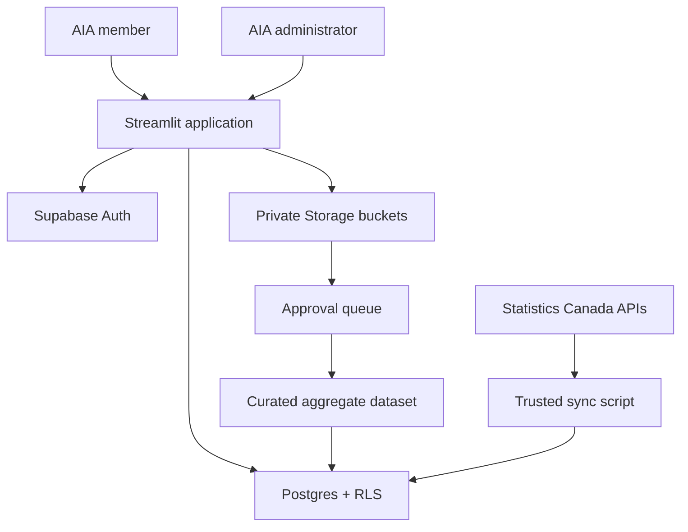

# Architecture and security decisions

## Trust boundaries

- Streamlit receives only the Supabase URL and publishable key. It never receives a secret/service-role key.
- Every normal database and Storage request runs as the signed-in user. Postgres and Storage RLS are authoritative.
- Auth-account edits and deletion go through the `admin-users` Edge Function. It verifies the caller with Supabase Auth, confirms an active administrator profile, and only then uses the server-only Auth administration API.
- Authorization uses the `profiles.role` and `profiles.membership_status` columns. It never trusts user-editable Auth `user_metadata`.
- A verified Auth user can still be `pending` or `suspended`; authentication does not imply portal authorization.
- Raw member files are private. Owners can read their own submissions; active admins can review all submissions.
- Approval changes workflow status only. Raw files do not become visible to members and are not automatically added to published analytics.
- Dataset “removal” defaults to archive. This preserves provenance and supports auditability.
- Statistics Canada data is synchronized by a trusted operator using a temporary server-side secret-key environment variable. Streamlit reads cached Supabase snapshots and never receives that key.
- Municipalities use census subdivisions and postal analysis uses three-character FSAs. Full postal codes are prohibited from member uploads.
- Municipality and FSA lookup is filtered in Supabase and capped at 100 results per search; the browser does not receive the full national geography list.
- The market bridge maps a selected geography's province to the closest geography published in the 2015 AIA benchmark. Municipal and FSA selections inherit that regional context and are never presented as local AIA observations.
- Market-scenario outputs remain client-side calculations. Census household counts and AIA benchmark values retain source labels; vehicle ownership, annual spending, shop count and target share are visibly marked as user assumptions.

## Roles

| Role | Capability |
|---|---|
| Pending member | Sign in and see the access-review screen only |
| Active member | Read published datasets/resources, export reports, submit aggregate shop data, see own submissions |
| Analyst | Same member access; reserved for future curated-analysis workflows |
| Admin | Manage access, review all submissions, stage/archive datasets, manage CMS resources |

Permanent user deletion removes the Auth account, profile, contribution rows and private contribution objects. It blocks self-deletion and protects the last active administrator. A minimal deletion event remains in the audit log for governance.

## Production hardening backlog

- Require MFA for admins and review Auth assurance level for sensitive actions.
- Add organization-level tenancy if multiple users will manage one shop’s submissions.
- Add antivirus/content scanning before reviewers download uploaded files.
- Define retention windows for rejected and archived contribution files.
- Add consent/data-sharing agreement version to every contribution.
- Add suppression rules for small cohorts before publishing aggregates.
- Send audit events to a centralized log/alerting service.
- Add French content and bilingual metadata before public/member launch.
