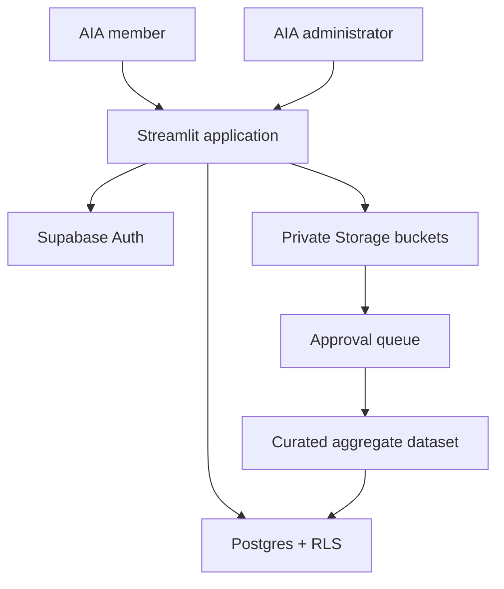

# Architecture and security decisions

## Trust boundaries

- Streamlit receives only the Supabase URL and publishable key. It never receives a secret/service-role key.
- Every normal database and Storage request runs as the signed-in user. Postgres and Storage RLS are authoritative.
- Authorization uses the `profiles.role` and `profiles.membership_status` columns. It never trusts user-editable Auth `user_metadata`.
- A verified Auth user can still be `pending` or `suspended`; authentication does not imply portal authorization.
- Raw member files are private. Owners can read their own submissions; active admins can review all submissions.
- Approval changes workflow status only. Raw files do not become visible to members and are not automatically added to published analytics.
- Dataset “removal” defaults to archive. This preserves provenance and supports auditability.

## Roles

| Role | Capability |
|---|---|
| Pending member | Sign in and see the access-review screen only |
| Active member | Read published datasets/resources, export reports, submit aggregate shop data, see own submissions |
| Analyst | Same member access; reserved for future curated-analysis workflows |
| Admin | Manage access, review all submissions, stage/archive datasets, manage CMS resources |

## Production hardening backlog

- Require MFA for admins and review Auth assurance level for sensitive actions.
- Add organization-level tenancy if multiple users will manage one shop’s submissions.
- Add antivirus/content scanning before reviewers download uploaded files.
- Define retention windows for rejected and archived contribution files.
- Add consent/data-sharing agreement version to every contribution.
- Add suppression rules for small cohorts before publishing aggregates.
- Send audit events to a centralized log/alerting service.
- Add French content and bilingual metadata before public/member launch.
