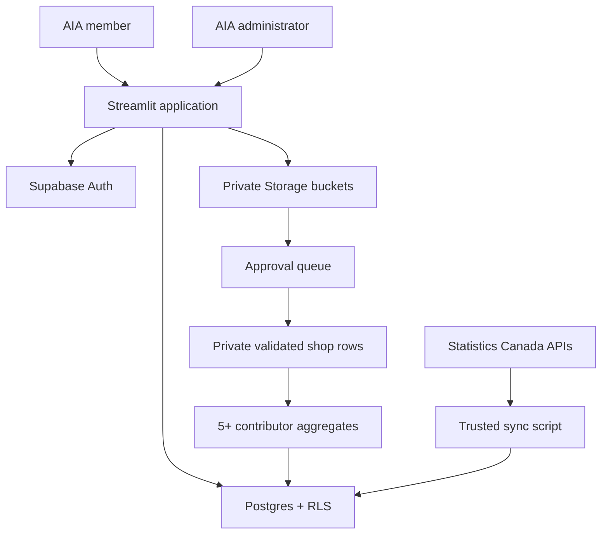

# Architecture and security decisions

## Trust boundaries

- Streamlit receives only the Supabase URL and publishable key. It never receives a secret/service-role key.
- Every normal database and Storage request runs as the signed-in user. Postgres and Storage RLS are authoritative.
- Auth-account edits and deletion go through the `admin-users` Edge Function. It verifies the caller with Supabase Auth, confirms an active administrator profile, and only then uses the server-only Auth administration API.
- Authorization uses the `profiles.role` and `profiles.membership_status` columns. It never trusts user-editable Auth `user_metadata`.
- A verified Auth user can still be `pending` or `suspended`; authentication does not imply portal authorization.
- Raw member files are private. Owners can read their own submissions; active admins can review all submissions.
- Approval revalidates the normalized CSV, imports shop-month rows into `approved_shop_observations`, and rebuilds `member_benchmark_aggregates`. Changing an approved contribution to rejected or archived removes its effect on the next rebuild.
- `approved_shop_observations` is protected by RLS and is available only to active administrators. Members query only `member_benchmark_aggregates`, which never stores a cohort with fewer than five distinct contributor accounts.
- Aggregation is national and provincial by month and shop type. Municipality and FSA cuts remain excluded because the present participation volume is too small for safe local publication.
- Dataset “removal” defaults to archive. This preserves provenance and supports auditability.
- Statistics Canada data is synchronized by a trusted operator using a temporary server-side secret-key environment variable. Streamlit reads cached Supabase snapshots and never receives that key.
- Municipalities use census subdivisions and postal analysis uses three-character FSAs. Full postal codes are prohibited from member uploads.
- Municipality and FSA lookup is filtered in Supabase and capped at 100 results per search; the browser does not receive the full national geography list.
- The market bridge maps a selected geography's province to the closest geography published in the 2015 AIA benchmark. Municipal and FSA selections inherit that regional context and are never presented as local AIA observations.
- Market-scenario outputs remain client-side calculations. Census household counts and AIA benchmark values retain source labels; vehicle ownership, annual spending, shop count and target share are visibly marked as user assumptions.
- Resource CMS entries use an explicit internal/external delivery type. Internal HTML is restricted to a presentation-safe allowlist before storage and sanitized again before rendering; scripts, forms, iframes, inline styles, event handlers and unsafe link schemes are removed. External resources require HTTPS links without embedded credentials.
- Administrator benchmark ingestion has two explicit contracts: regional/shop-size observations and performance-cohort metrics. CSV upload and manual row entry share one server-side validator, and the repository repeats validation before storing a normalized private draft. This prevents the UI from being the only data-quality boundary.

## Roles

| Role | Capability |
|---|---|
| Pending member | Sign in and see the access-review screen only |
| Active member | Read published datasets/resources, export reports, submit aggregate shop data, see own submissions |
| Analyst | Same member access; reserved for future curated-analysis workflows |
| Admin | Manage access, review all submissions, stage/archive datasets, manage CMS resources |

## Member contribution data flow

1. A member uploads a file or builds a manual draft. Both paths use the same validation contract and private Storage bucket.
2. An administrator reviews the normalized submission. Approval repeats validation before any analytical ingestion.
3. Approved shop-month rows enter the administrator-only observation table with contribution provenance.
4. A security-invoker database function rebuilds the aggregate table as the signed-in administrator. RLS remains authoritative; no service key is present in Streamlit.
5. Only cohorts containing at least five distinct contributor accounts are stored. Members can chart and export these national or provincial aggregates from **Member Data Pool**.

Validated administrator dataset drafts are source-file records, not automatically published dashboard observations. Promotion into analytical tables remains a separate governed action so review and dataset-version selection can be added without silently mixing reporting years.

Permanent user deletion removes the Auth account, profile, contribution rows and private contribution objects. It blocks self-deletion and protects the last active administrator. A minimal deletion event remains in the audit log for governance.

## Production hardening backlog

- Require MFA for admins and review Auth assurance level for sensitive actions.
- Add organization-level tenancy if multiple users will manage one shop’s submissions.
- Add antivirus/content scanning before reviewers download uploaded files.
- Define retention windows for rejected and archived contribution files.
- Add consent/data-sharing agreement version to every contribution.
- Reassess whether selected measures or geographic cuts require a threshold higher than five contributors.
- Send audit events to a centralized log/alerting service.
- Add French content and bilingual metadata before public/member launch.
